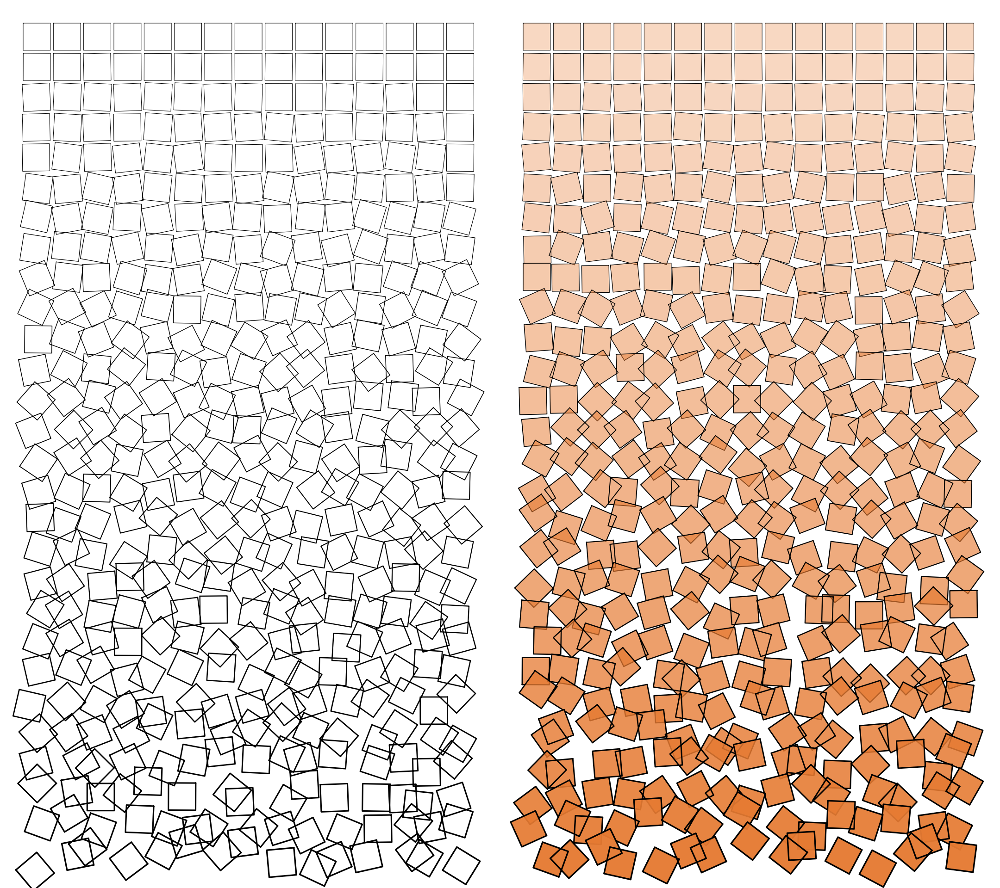

### About

An implementation of Georg Nees' [Schotter](http://www.medienkunstnetz.de/works/schotter/), inspired by [antirez](httsp://github.com/antirez)'s [LOLWUT](http://antirez.com/news/123) implementation.

### Compile

```
go build
```

### Run

```
./schotter
```

### Output

```
./out.png`
```

### Example outputs


